# PROMETHEUS // Quantum Execution Intelligence

**Early-stage prototype for hardware-aware quantum execution, compiler integration, and intelligent multi-QPU job dispatch.**

Prometheus is an early-phase research and development prototype exploring a broader execution layer for heterogeneous quantum computing environments.

The current implementation is deliberately narrow: it benchmarks hardware-aware execution selection against **SABRE O3** on a limited set of **IBM Quantum processors available through the IBM Quantum Free Tier**. The purpose of this stage is to establish the execution-selection concept on real hardware before expanding across compilers, processors, vendors, and quantum hardware technologies.

> **This repository demonstrates the prototype that exists today. The multi-compiler, multi-vendor dispatcher described below is the development direction, not a claim that those integrations are already implemented.**

---

## What is Prometheus?

Prometheus is being developed as a **supervisory execution-intelligence and dispatch layer** for quantum computing systems.

Existing compilation infrastructure can generate valid physical realizations of a logical workload. Prometheus evaluates available execution candidates against the **current hardware environment** and selects a candidate according to its proprietary hardware-aware execution objective.

At a high level:

```text
Quantum Workload
       │
       ▼
Candidate Generation
       │
       ├────────────── Current Hardware Characterization
       │
       ▼
Hardware-Aware Evaluation
       │
       ▼
Execution Selection
       │
       ▼
QPU Dispatch
       │
       ▼
Observed Execution
       │
       ▼
Execution / Drift Information
```

The systems distinction is between **generating a valid execution** and **deciding which valid execution is most suitable for the hardware state in which it will run**.

---

# Current prototype

The current prototype provides an experimental environment for:

- IBM Quantum processor discovery and hardware characterization;
- workload configuration;
- SABRE O3 candidate generation;
- evaluation of multiple compiler trajectories;
- hardware-aware candidate selection;
- comparative execution;
- cross-QPU arbitration across the supported IBM processors;
- real hardware dispatch through the operational interface;
- collection and inspection of execution results.

### Current boundary

**SABRE O3 + selected IBM Quantum processors + IBM Quantum Free Tier access.**

This limitation is intentional. The project is being developed outward from a real, testable prototype rather than presenting future integrations as capabilities that already exist.

---

# Visual demonstration

The screenshots are the primary visual record of the current prototype. **Click any image to open the full-resolution screenshot.**

## Demonstration 1 — Configure the prototype

The first six screenshots show the operational workflow from the Studio interface through workload configuration and execution preparation.

| | |
|---|---|
| [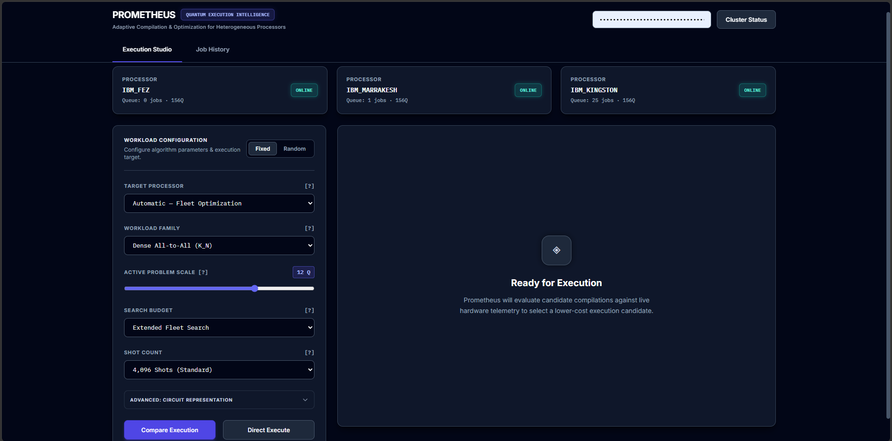](screenshots/01-studio-overview.png) | [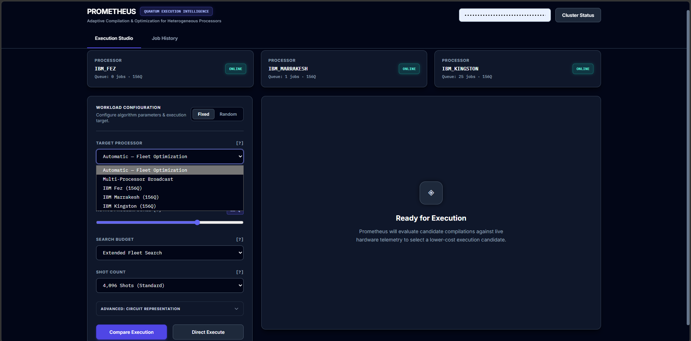](screenshots/02-target-processor.png) |
| **01 — Studio overview** | **02 — Target processor** |
| [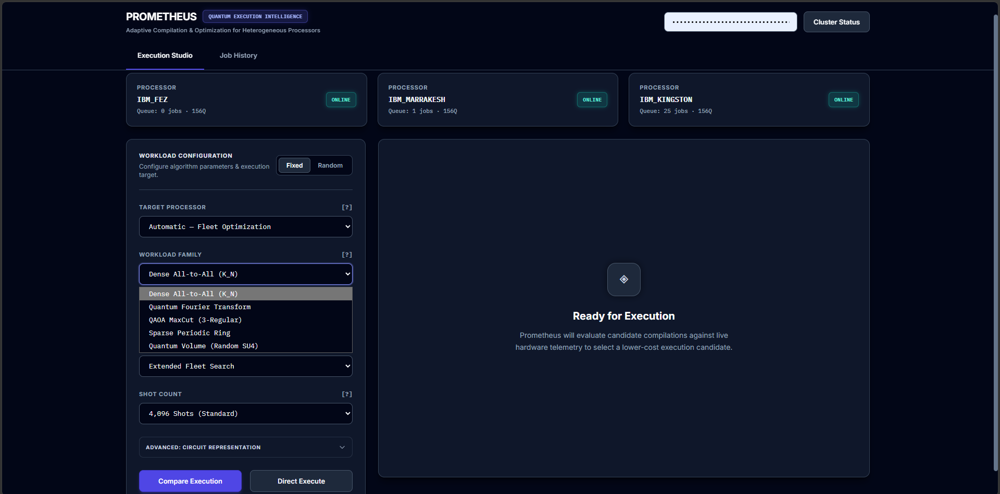](screenshots/03-workload-family.png) | [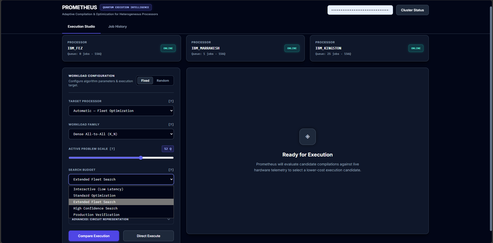](screenshots/04-search-budget.png) |
| **03 — Workload family** | **04 — Search budget** |
| [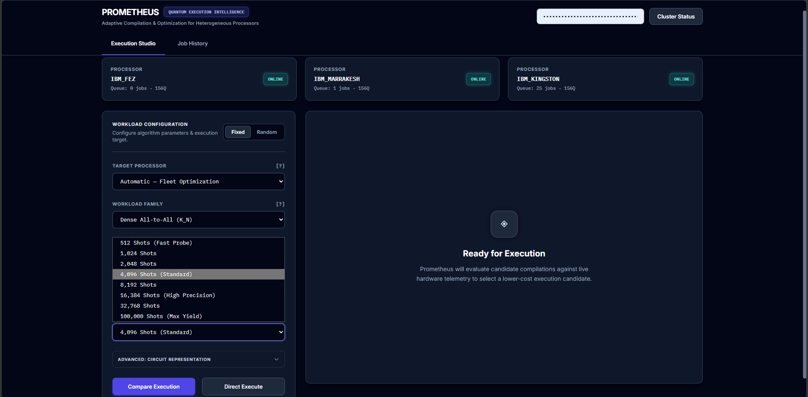](screenshots/05-shot-count.png) | [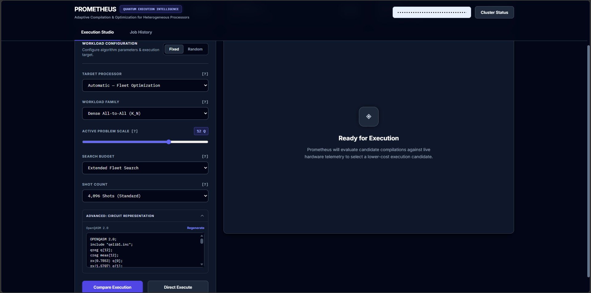](screenshots/06-logical-qasm.png) |
| **05 — Shot count** | **06 — Logical QASM** |

**What this demonstrates:** Prometheus provides a single operational interface for preparing and dispatching hardware-aware quantum executions.

---

## Demonstration 2 — Candidate evaluation and selection

The current prototype uses **SABRE O3** as its candidate-generation baseline. Multiple valid execution candidates can be evaluated against current hardware characterization, with the system selecting or retaining a candidate according to its protected execution-selection mechanism.

The proprietary decision mechanism is intentionally outside this repository.

---

## Demonstration 3 — Cross-QPU arbitration

The current prototype can assess supported IBM Quantum processors as potential execution targets. The intended direction is to extend the same abstraction across additional processors, vendors, and processor technologies.

The key systems idea is **workload-specific processor selection**, rather than maintaining only a permanent static ranking of QPUs.

---

## Demonstration 4 — Quantum Volume

The Quantum Volume execution is the clearest complete view of the prototype's comparative execution workflow. The five screenshots should be read together: result summary → hardware allocation → circuit characteristics → output distribution → logical/compiled circuit view.

### 07 — QV execution result

[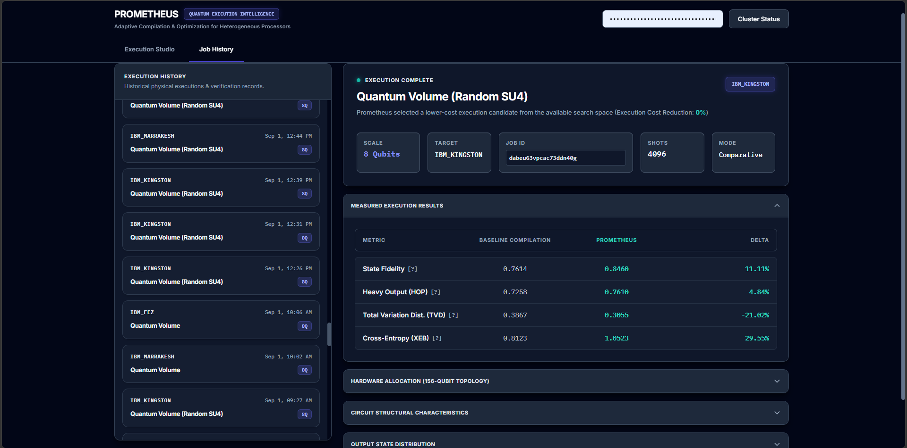](screenshots/07-qv-execution-result.png)

Completed comparative Quantum Volume execution and result summary.

### 08 — QV hardware allocation

[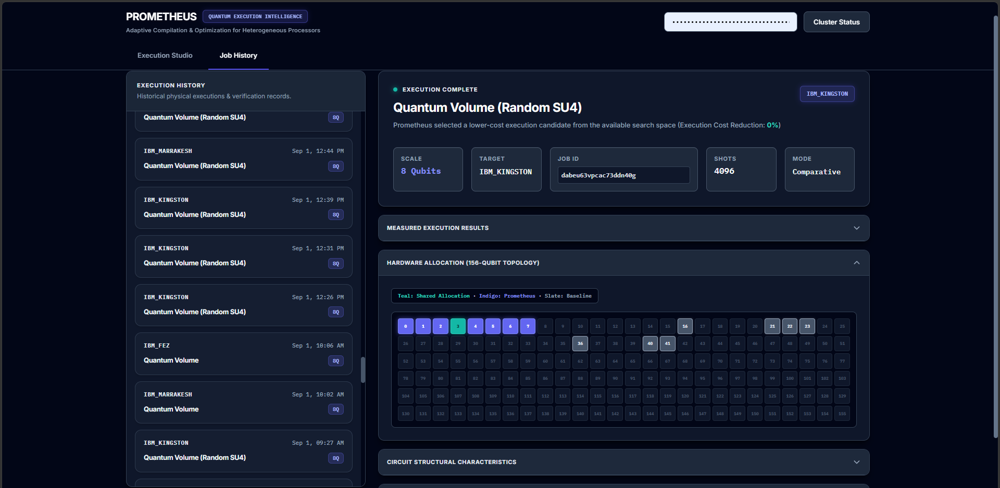](screenshots/08-qv-hardware-allocation.png)

Hardware allocation associated with the execution.

### 09 — QV circuit structural characteristics

[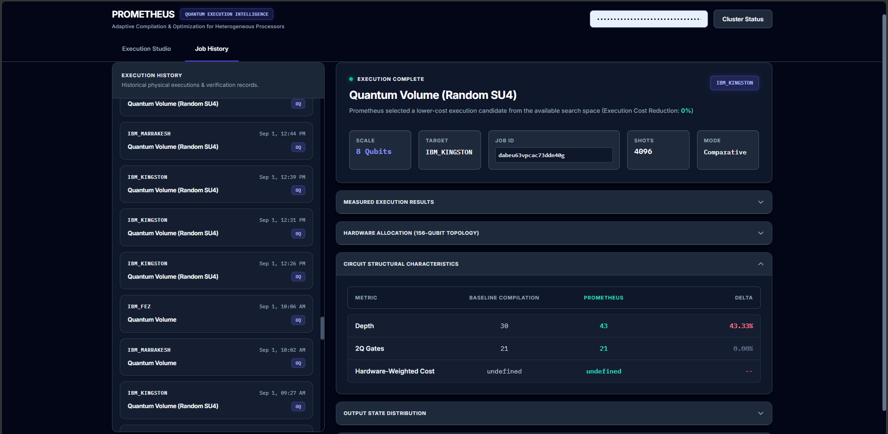](screenshots/09-qv-circuit-structural-characteristics.png)

Structural information exposed for the QV circuit.

### 10 — QV output state distribution

[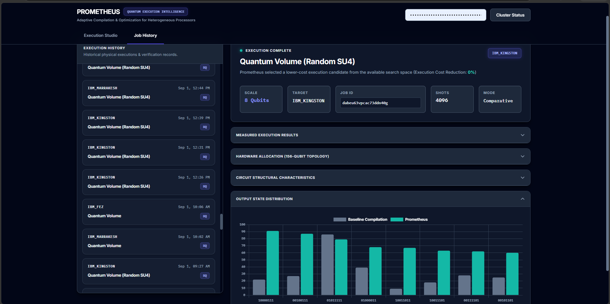](screenshots/10-qv-output-state-distribution.png)

Observed output-state distribution.

### 11 — QV logical / compiled QASM

[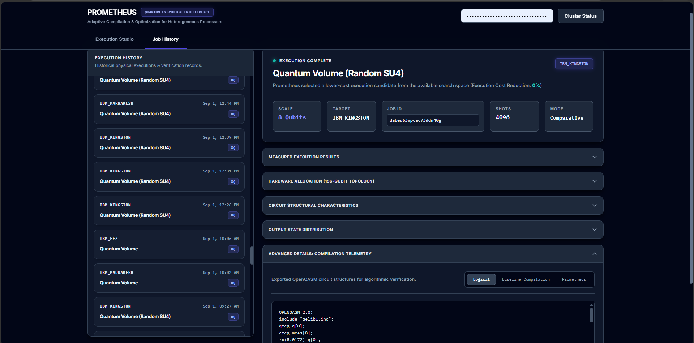](screenshots/11-qv-logical-compiled-qasm.png)

Logical and compiled QASM views exposed by the interface.

**What this demonstrates:** comparative hardware execution with measured quality indicators, allocation information, circuit characteristics, compiled-circuit information, and output distributions.

---

## Demonstration 5 — Dense workload and observed behavior

The Dense workload screenshots contain both repeated-run observations and topology/gain comparisons.

### Run-variation controls

| | |
|---|---|
| [](screenshots/12-dense-execution-drift-test1.png) | [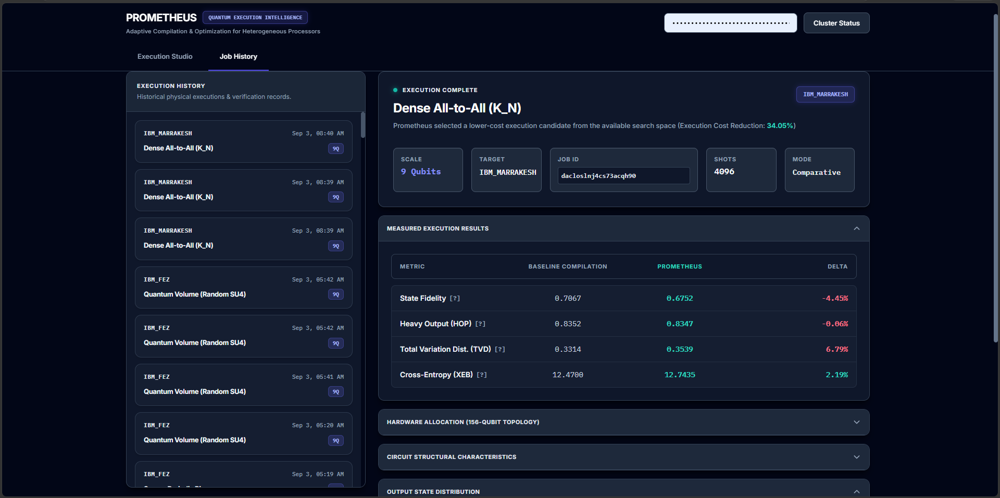](screenshots/13-dense-execution-drift-test2.png) |
| **12 — Dense execution drift test 1** | **13 — Dense execution drift test 2** |
| [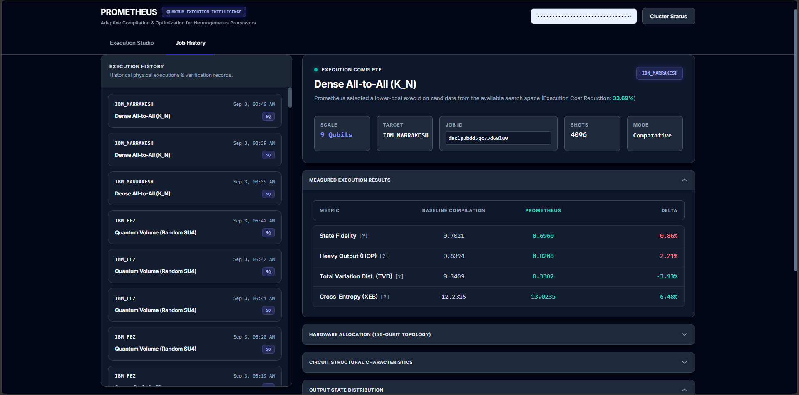](screenshots/14-dense-execution-drift-test3.png) | |
| **14 — Dense execution drift test 3** | |

These repeated executions were used to observe short-timescale hardware/run variation. They are **controls for hardware variability**, not isolated examples intended to imply that the routing mechanism itself failed.

### Observed gains and topology comparisons

| | |
|---|---|
| [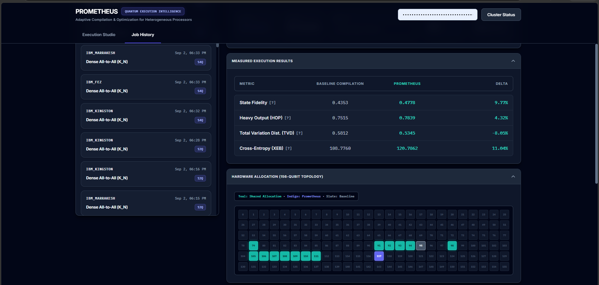](screenshots/15-observed-gains-topology-comparison1.png) | [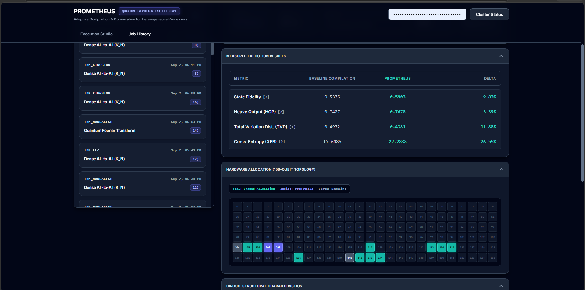](screenshots/16-observed-gains-topology-comparison2.png) |
| **15 — Observed gains / topology comparison 1** | **16 — Observed gains / topology comparison 2** |
| [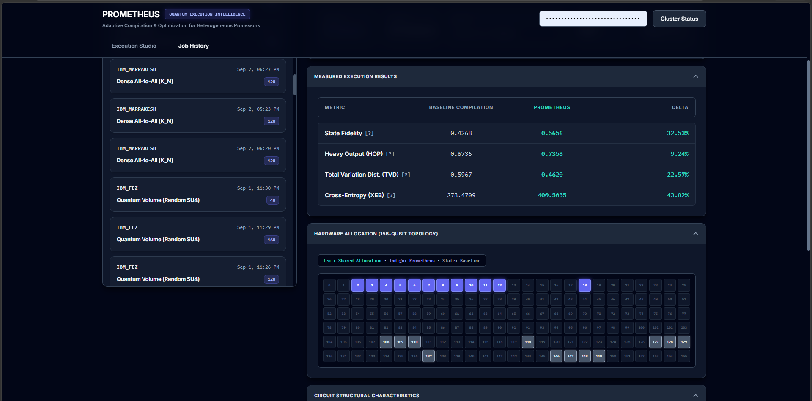](screenshots/17-observed-gains-topology-comparison3.png) | [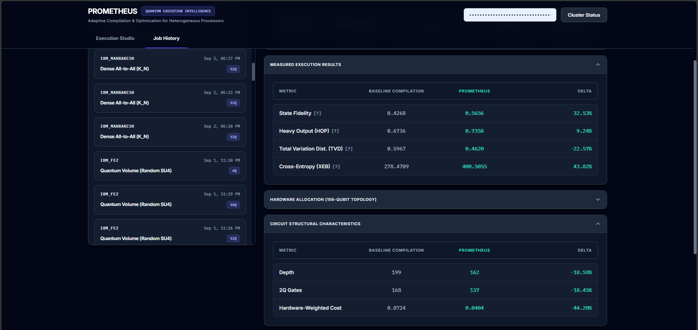](screenshots/18-observed-gains-topology-comparison3-depth-comparison.png) |
| **17 — Observed gains / topology comparison 3** | **18 — Observed gains / topology comparison 3 — depth comparison** |

The supplied demonstration set includes a representative **9-qubit Dense All-to-All execution on IBM Marrakesh** with a displayed **43.02% execution-cost reduction** and improvements across the displayed fidelity, HOP, TVD, and XEB metrics.

**What this demonstrates:** the prototype can expose favorable execution comparisons while also making run-to-run variability visible rather than hiding it.

---

# Representative execution

The representative Dense All-to-All 9-qubit IBM Marrakesh execution shown in the screenshots reports:

| Metric | Baseline | Prometheus | Displayed delta |
|---|---:|---:|---:|
| Execution cost reduction | — | — | **43.02%** |
| State Fidelity | 0.6815 | 0.7004 | **+2.77%** |
| Heavy Output Probability | 0.8289 | 0.8440 | **+1.83%** |
| Total Variation Distance | 0.3528 | 0.3308 | **-6.23%** |
| Cross-Entropy (XEB) | 11.4691 | 13.0769 | **+14.02%** |

These values are screenshot-derived and are presented as representative demonstration evidence, not as a universal performance guarantee.

---

# Demonstrated capabilities

## Operational execution interface

The Prometheus Studio provides an operational interface for viewing processors, configuring workloads, setting search and shot budgets, preparing comparative execution, dispatching jobs, and inspecting completed results.

## Hardware-aware candidate selection

Prometheus can evaluate multiple valid execution candidates rather than treating a single compiler trajectory as the only available option.

The proprietary selection mechanism is intentionally not disclosed in this repository.

## Cross-QPU arbitration

The prototype can assess a workload across multiple operational IBM Quantum processors and select a target based on workload-specific execution assessment.

## Comparative execution

The Studio exposes measured indicators including:

- state fidelity;
- Heavy Output Probability;
- Total Variation Distance;
- Cross-Entropy / XEB;
- execution metadata;
- hardware allocation;
- circuit characteristics;
- output-state distributions.

## Baseline retention

The system can retain the reference execution when an alternative does not provide a favorable modeled outcome. It does not need to force an intervention simply because alternatives exist.

## Hardware/run variability observation

Repeated executions are included as controls for short-timescale run-to-run variation. Real hardware behavior is part of the operating environment and should be measured rather than hidden.

---

# From prototype to broader execution infrastructure

The current **SABRE O3 + IBM** implementation is a starting point rather than the endpoint.

The broader direction is to make the execution layer **compiler-agnostic and processor-agnostic**.

## Planned compiler expansion

The candidate-generation layer is intended to support multiple compilation frameworks, including exploration of:

- SABRE / Qiskit;
- TKET;
- additional compiler and routing strategies;
- other candidate-generation technologies as they become relevant.

The objective is not to replace these compilers. Their outputs become alternative execution candidates that can be evaluated within a common execution-selection framework.

## Planned hardware expansion

The current experiments are limited to a small IBM Quantum hardware set. Future development is intended to expand coverage to:

- additional IBM Quantum processors;
- Quantinuum;
- IonQ;
- other quantum-computing providers;
- superconducting processors;
- trapped-ion processors;
- other emerging quantum processor architectures.

The intended system is not restricted to superconducting hardware. Where suitable interfaces and relevant hardware characterization are available, the same execution-arbitration abstraction can be applied across different processor technologies.

---

# Long-term system direction

The longer-term concept is a **multi-compiler, multi-QPU execution-intelligence and dispatch layer**.

```text
                         Quantum Workload
                                │
                                ▼
                  ┌─────────────────────────┐
                  │ Candidate Generation    │
                  │                         │
                  │ SABRE / Qiskit          │
                  │ TKET                    │
                  │ Other compilers         │
                  └────────────┬────────────┘
                               │
                     Execution candidates
                               │
             ┌─────────────────┴─────────────────┐
             │                                   │
             ▼                                   ▼
   Current hardware state              Processor capabilities
             │                                   │
             └─────────────────┬─────────────────┘
                               ▼
                  Hardware-Aware Arbitration
                               │
                               ▼
              Compiler + Execution + QPU Selection
                               │
                               ▼
                         Job Dispatch
                               │
                               ▼
                       Observed Execution
```

In this direction, a workload would not be tied to one compiler or one processor by default. The system would be able to consider **which compilation strategy, which physical execution candidate, and which available QPU are most appropriate for the workload and current hardware conditions**.

The phrase **“most appropriate”** is intentional. This is an arbitration and decision framework; it does not claim that a universal optimum exists across every workload, device, and calibration state.

---

# Practical utility

Potential applications include:

- **Quantum fleet management:** workload-specific QPU selection and execution-aware dispatch.
- **Compiler / transpiler enhancement:** evaluate multiple compiler trajectories without replacing existing compilation infrastructure.
- **Multi-vendor quantum execution:** provide a common arbitration abstraction across providers and processor technologies.
- **Enterprise quantum workloads:** add execution selection, dispatch, history, and drift observation between applications and quantum processors.
- **Quantum benchmarking and R&D:** compare compiler strategies, QPUs, workload structures, calibration states, and execution conditions.

---

# What I want and what I need

A recurring question in discussions around Prometheus has been: **What do I want?**

There are two different answers.

## What I want

I want to continue doing the work itself:

- analyzing data;
- identifying systems that can be improved;
- designing mathematical and computational approaches to optimize those systems;
- applying that approach across scientific domains, not only quantum computing;
- turning analysis into practical systems;
- collaborating with researchers who are genuinely passionate about understanding difficult problems and building better systems.

Prometheus is one example of this approach. The larger ambition is not to be defined by a single compiler, QPU, company, or scientific field. It is to keep doing rigorous analytical and systems-design work wherever there is a meaningful opportunity to improve an existing system.

## What I need

To do that work at a meaningful scale, I need the **funding and resources** to support sustained research and development.

That means access to:

- scientific and experimental infrastructure;
- quantum processors and other specialized hardware;
- computing resources;
- high-quality data;
- engineering support where useful;
- domain experts and research collaborators;
- an environment that allows long-term experimentation rather than one-off demonstrations.

Commercialization can be one mechanism for sustaining the work, but the underlying objective is to create the resources and collaborations needed to continue analyzing data, designing systems, and testing improvements across increasingly difficult scientific problems.

---

# Public disclosure boundary

This repository is a **public demonstration and capability record**, not a publication of the protected implementation.

### Public

- interface screenshots;
- system workflow;
- high-level architecture;
- representative execution outcomes;
- current prototype scope;
- broader development direction;
- practical applications;
- demonstration narrative.

### Controlled

- implementation;
- proprietary equations and derivation;
- feature construction;
- weights and coefficients;
- internal ranking;
- detailed selection heuristics;
- private infrastructure.

The public repository intentionally does not provide the complete chain required to reconstruct the proprietary execution-selection mechanism.

---

# Important scope and interpretation

The current prototype should **not** be interpreted as:

- a completed universal quantum dispatcher;
- a replacement for Qiskit, SABRE, TKET, or other compiler infrastructure;
- a guarantee of improved fidelity on every workload;
- a claim that all planned vendor or processor integrations already exist;
- a claim of a universal optimum.

The current results are evidence from an early prototype operating under specific hardware and execution conditions. Neutral or unfavorable observations are also valuable because they define the limits of the current system and motivate further validation.

---

# Repository guide

- [Architecture](ARCHITECTURE.md) — high-level system abstraction and separation of responsibilities.
- [Project direction](PROJECT_DIRECTION.md) — current prototype, broader system direction, and the distinction between what I want and what I need.
- [Demonstration narrative](demonstrations/DEMONSTRATIONS.md) — detailed walkthrough of the demonstrations.
- [Results](results/RESULTS.md) — representative observed outcomes and validation direction.
- [Screenshot gallery](SCREENSHOT_GALLERY.md) — complete screenshot index.
- [Public disclosure boundary](PUBLIC_DISCLOSURE.md) — what is intentionally public and what remains controlled.

---

# Closing

The current repository is the first practical demonstration of a larger systems direction:

**multiple valid quantum executions → hardware-aware evaluation → appropriate compiler / circuit / QPU selection → dispatch → observed execution.**

The prototype starts with SABRE O3 and IBM Quantum hardware. The intended development path is to expand that execution abstraction across compilers, processors, vendors, and quantum hardware technologies while keeping the proprietary decision mechanism protected.
